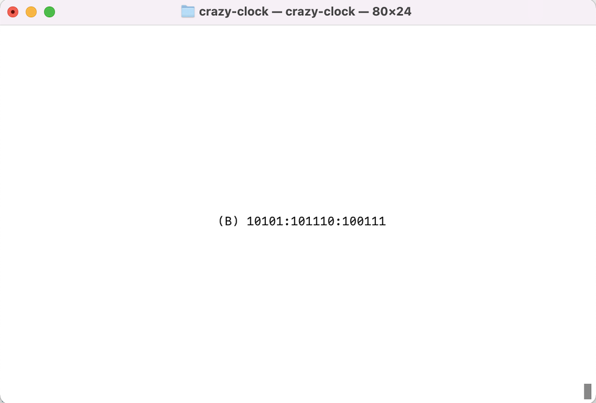
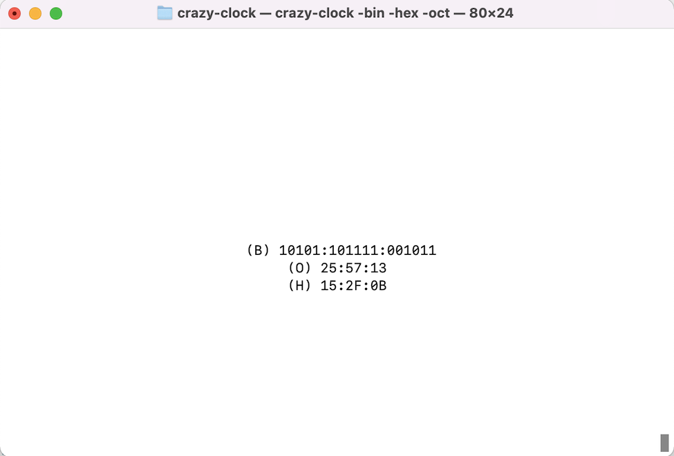
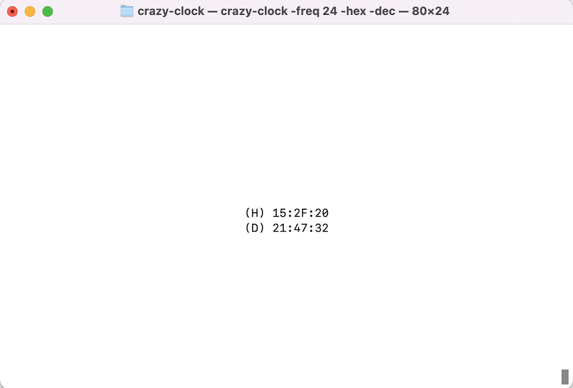

# Crazy-Clock

## Features
* Displays a clock in binary, hex, octal, and/or decimal.
* Uses ncurses to display the output in the center of your terminal.

## Parameters
* ```-freq <number>``` specify the number of times per second that the display is updated.  By default, this is set to 4.  If you are in the habit of resizing your terminal, it will
be smoother if you set this to a higher number.
* ```-hex``` display the current clock in hexadecimal format
* ```-oct``` display the current clock in octal format
* ```-bin``` display the current clock in binary format (this is the default format)
* ```-dec``` display the current clock in decimal format
You may specify as many formats as you wish - each one will be printed on a separate line.

## Examples
```
 % ./crazy-clock
```

```
 % ./crazy-clock -bin -hex -oct
```

```
 % ./crazy-clock -freq 24 -hex
```



## Dependencies
This project uses ncurses, which is probably already be on your system.  If not,
it can usually be installed with your system package manager.  For example:
```
 % sudo apt install libncurses5 libncurses5-dev
```

## Building
To build the Crazy-Clock, use ```make```:
```
 % make
cc -Wall -Wextra -g -c crazy-clock.c
cc -Wall -Wextra -g -c libcrazytime.c
cc -Wall -Wextra -g crazy-clock.o libcrazytime.o -o crazy-clock -lncurses
```